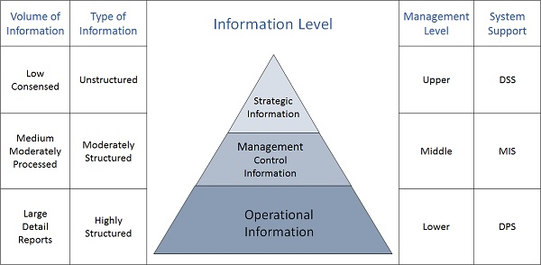

# Definitions

- [source: tutorialspoint.com](https://www.tutorialspoint.com/system_analysis_and_design/index.htm)

- DSS - Decision Support System
- MIS - Management Information Systems
- DPS - Data Processing System